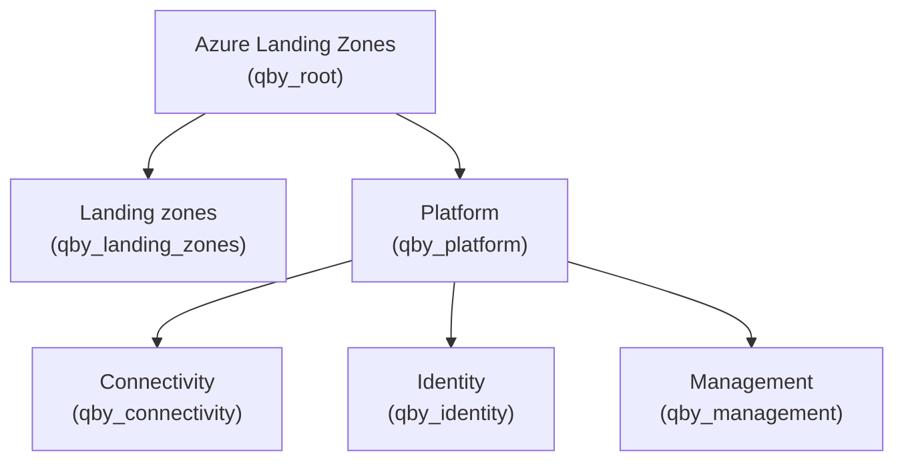

# terraform-azurerm-avm-lib-policies-alz

The QBY AVM Library supercedes the old [q.beyond Archetype Library](https://github.com/qbeyond/terraform-azurerm-archetype-lib)
that was based off the (now deprecated) [Cloud Adoption Framework](https://github.com/Azure/terraform-azurerm-caf-enterprise-scale).
It instead enriches the new [Azure Landing Zone Accelerator](https://azure.github.io/Azure-Landing-Zones/accelerator/) with useful
Azure policy definitions and assignments, provided by q.beyond.

## Usage

```terraform
provider "alz" {
  library_references = [
    {
      path = "platform/alz"
      ref  = "2026.04.2" # Replace with the desired version
    }
    {
      custom_url = "github.com/qbeyond/terraform-azurerm-avm-lib-policies-alz/qby" # Custom policies by QBY
    },
    {
      custom_url = "github.com/qbeyond/terraform-azurerm-avm-lib-policies-alz/alz_extend" # Extends default Microsoft library
    }
  ]
}
```

## Architectures
  
The following architectures are available in this library, please note that the diagrams denote the management group display name and, in brackets, the associated archetypes:
  
### architecture `qby`
  
> [!NOTE]  
> This hierarchy will be deployed as a child of the user-supplied root management group.
  

  
## Archetypes
  
### archetype `qby_connectivity`
  
#### qby_connectivity policy assignments
  
<details><summary>0 policy assignments</summary>

</details>
  
### archetype `qby_identity`
  
#### qby_identity policy assignments
  
<details><summary>0 policy assignments</summary>

</details>
  
### archetype `qby_landing_zones`
  
#### qby_landing_zones policy assignments
  
<details><summary>1 policy assignments</summary>

- QBY-Deploy-Update-Mgmt

</details>
  
### archetype `qby_management`
  
#### qby_management policy assignments
  
<details><summary>0 policy assignments</summary>

</details>
  
### archetype `qby_platform`
  
#### qby_platform policy assignments
  
<details><summary>1 policy assignments</summary>

- QBY-Deploy-Update-Mgmt

</details>
  
### archetype `qby_root`
  
#### qby_root policy definitions
  
<details><summary>6 policy definitions</summary>

- QBY-Configure-Linux-Patch-Settings
- QBY-Configure-Windows-Patch-Settings
- QBY-Deploy-Updates
- QBY-Deploy-Updates-Linux
- QBY-Require-Severity-Group-Tag
- QBY-Require-Update-Allowed-Tag

</details>
  
#### qby_root policy set definitions
  
<details><summary>1 policy set definitions</summary>

- QBY-Deploy-Update-Mgmt

</details>
  
#### qby_root policy assignments
  
<details><summary>1 policy assignments</summary>

- QBY-Deploy-Update-Mgmt

</details>
  
## Policy Default Values
  
The following policy default values are available in this library:
  
### default name `qby_updmang_noMaintenanceConfigurationId`
  
No maintenaince configuration.
  
|        ASSIGNMENT      |       PARAMETER NAMES        |
|------------------------|------------------------------|
| QBY-Deploy-Update-Mgmt | noMaintenanceConfigurationId |

### default name `qby_updmang_managementSubscriptionId`
  
Management subscription for update management resource.
  
|        ASSIGNMENT      |      PARAMETER NAMES     |
|------------------------|--------------------------|
| QBY-Deploy-Update-Mgmt | managementSubscriptionId |

### default name `qby_updmang_managementResourceGroup`
  
Management resource group for update management resources.
  
|        ASSIGNMENT      |     PARAMETER NAMES     |
|------------------------|-------------------------|
| QBY-Deploy-Update-Mgmt | managementResourceGroup |

### default name `qby_updmang_location`
  
Location for update management resources.
  
|        ASSIGNMENT      | PARAMETER NAMES |
|------------------------|-----------------|
| QBY-Deploy-Update-Mgmt |    location     |

### default name `qby_updmang_timeZone`
  
Time zone for update management resources.
  
|        ASSIGNMENT      | PARAMETER NAMES |
|------------------------|-----------------|
| QBY-Deploy-Update-Mgmt |    timeZone     |

### default name `qby_updmang_osTypeArc`
  
OS type for Arc machines in update management.
  
|        ASSIGNMENT      | PARAMETER NAMES |
|------------------------|-----------------|
| QBY-Deploy-Update-Mgmt |    osTypeArc    |

### default name `qby_updmang_osOffersLinux`
  
List of allowed OS offers for Linux VMs in update management.
  
|        ASSIGNMENT      | PARAMETER NAMES |
|------------------------|-----------------|
| QBY-Deploy-Update-Mgmt |  osOffersLinux  |

### default name `qby_updmang_osSKUsLinux`
  
List of allowed OS SKUs for Linux VMs in update management.
  
|        ASSIGNMENT      | PARAMETER NAMES |
|------------------------|-----------------|
| QBY-Deploy-Update-Mgmt |   osSKUsLinux   |

### default name `qby_updmang_osOffersWindows`
  
List of allowed OS offers for Windows VMs in update management.
  
|        ASSIGNMENT      | PARAMETER NAMES |
|------------------------|-----------------|
| QBY-Deploy-Update-Mgmt | osOffersWindows |

### default name `qby_updmang_osSKUsWindows`
  
List of allowed OS SKUs for Windows VMs in update management.
  
|        ASSIGNMENT      | PARAMETER NAMES |
|------------------------|-----------------|
| QBY-Deploy-Update-Mgmt | osSKUsWindows   |

### default name `qby_updmang_effectLinux`
  
Effect for Linux VMs in update management policy.
  
|        ASSIGNMENT      | PARAMETER NAMES |
|------------------------|-----------------|
| QBY-Deploy-Update-Mgmt |   effectLinux   |

### default name `qby_updmang_effectWindows`
  
Effect for Windows VMs in update management policy.
  
|        ASSIGNMENT      | PARAMETER NAMES |
|------------------------|-----------------|
| QBY-Deploy-Update-Mgmt |  effectWindows  |
  
---

## Contents
  
### all policy definitions
  
<details><summary>6 policy definitions</summary>

- QBY-Configure-Linux-Patch-Settings
- QBY-Configure-Windows-Patch-Settings
- QBY-Deploy-Updates
- QBY-Deploy-Updates-Linux
- QBY-Require-Severity-Group-Tag
- QBY-Require-Update-Allowed-Tag

</details>
  
### all policy set definitions
  
<details><summary>1 policy set definitions</summary>

- QBY-Deploy-Update-Mgmt

</details>
  
### all policy assignments
  
<details><summary>1 policy assignments</summary>

- QBY-Deploy-Update-Mgmt

</details>
  